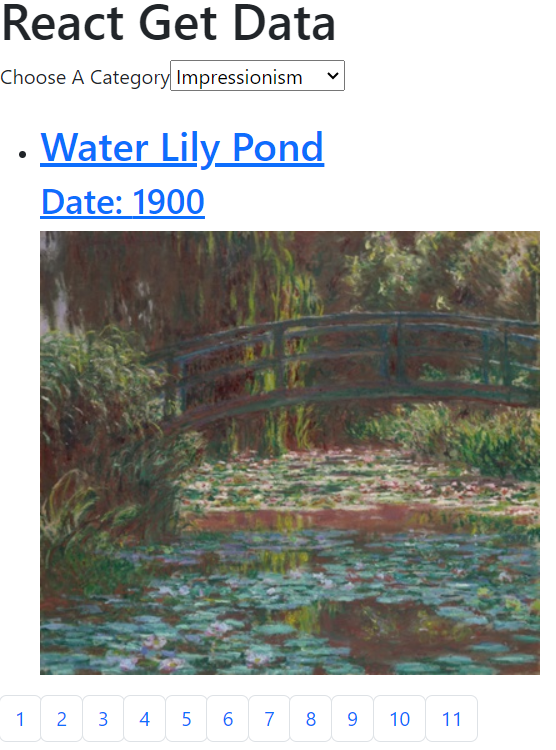

# Fetch and Render API Data
## Fetch and Render API Data Exercise
 
This web page uses React. It fetches API data from the Art Institute of Chicago and renders up to ten art images along with their titles and dates according to the collection selected from the dropdown list. The user can look through the ten items using the bootstrap rendered buttons below the image.
To run this on your machine, download the files, start an http-server for the folder within which the files reside, and load the .html file on your browser by typing localhost:8080.
Additional functionality that would be helpful to a user for future iterations would be to include multiple fields of entry to specify by artist and by year, and to display more than one image at a time.  
MIT License
Copyright (c) 2023 Yvette Watson

Permission is hereby granted, free of charge, to any person obtaining a copy of this software and associated documentation files (the "Software"), to deal in the Software without restriction, including without limitation the rights to use, copy, modify, merge, publish, distribute, sublicense, and/or sell copies of the Software, and to permit persons to whom the Software is furnished to do so, subject to the following conditions:

The above copyright notice and this permission notice shall be included in all copies or substantial portions of the Software.

THE SOFTWARE IS PROVIDED "AS IS", WITHOUT WARRANTY OF ANY KIND, EXPRESS OR IMPLIED, INCLUDING BUT NOT LIMITED TO THE WARRANTIES OF MERCHANTABILITY, FITNESS FOR A PARTICULAR PURPOSE AND NONINFRINGEMENT. IN NO EVENT SHALL THE AUTHORS OR COPYRIGHT HOLDERS BE LIABLE FOR ANY CLAIM, DAMAGES OR OTHER LIABILITY, WHETHER IN AN ACTION OF CONTRACT, TORT OR OTHERWISE, ARISING FROM, OUT OF OR IN CONNECTION WITH THE SOFTWARE OR THE USE OR OTHER DEALINGS IN THE SOFTWARE.
